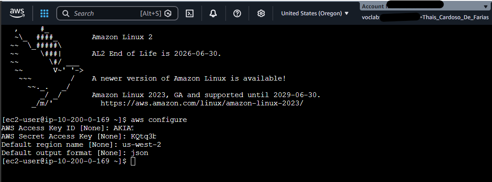
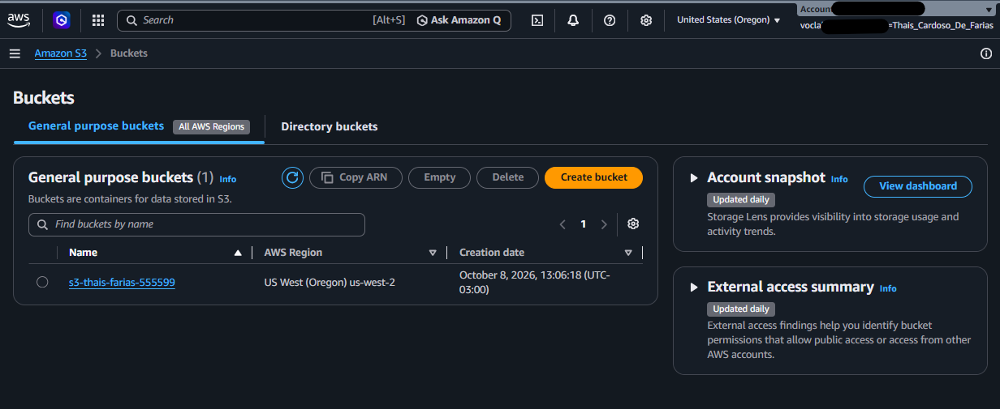
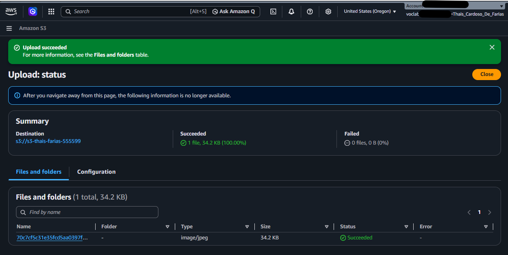
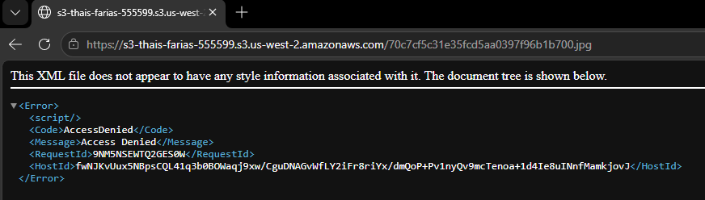
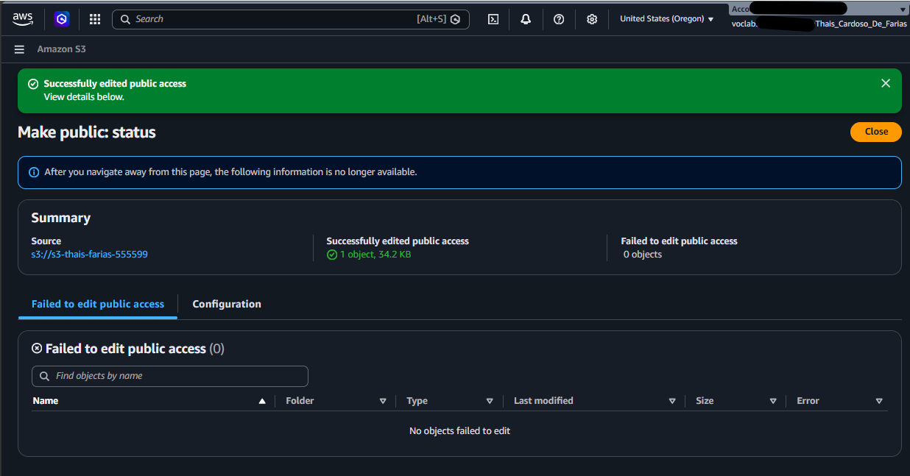
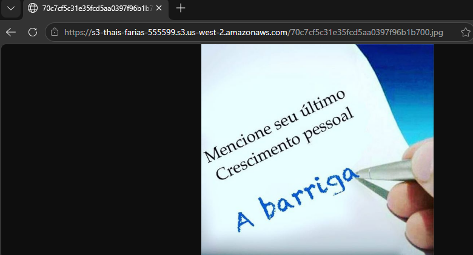
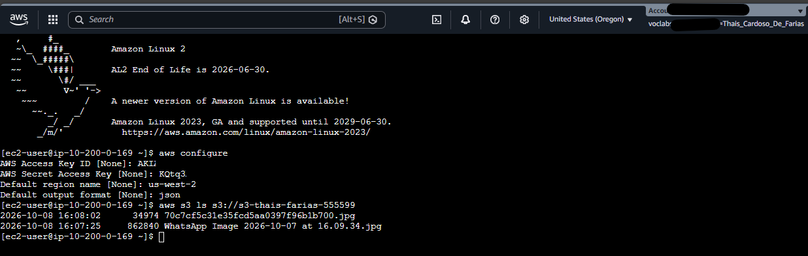

# 🪣 AWS S3 – Controle de Acesso a Objetos com ACLs e AWS CLI

Laboratório prático em que criei um bucket no **Amazon S3**, testei o comportamento de acesso **privado por padrão**, tornei um objeto público via **ACL** e validei o conteúdo usando o **AWS CLI** a partir de uma instância **EC2**.


---

## 🎯 Objetivo

Entender na prática como o S3 controla o acesso a objetos e como o AWS CLI é usado para interagir com o serviço, cobrindo:

- Configuração do AWS CLI em uma instância EC2
- Criação de bucket com ACLs habilitadas
- Comportamento padrão de acesso (privado)
- Liberação de acesso público a um objeto específico via ACL
- Listagem de objetos via linha de comando

## 🧰 Serviços e ferramentas

| Serviço / Ferramenta | Uso no lab |
|---|---|
| **Amazon S3** | Armazenamento do bucket e do objeto |
| **Amazon EC2** (instância *CLI Host*) | Ambiente para executar comandos do AWS CLI |
| **EC2 Instance Connect** | Acesso ao terminal da instância pelo navegador |
| **AWS CLI** | Configuração de credenciais e listagem do bucket |
| **Vocareum** | Ambiente de laboratório com credenciais temporárias |

**Região:** `us-west-2` (Oregon)

---

## 🗺️ Visão geral do fluxo

```
Navegador ──► S3 (objeto privado)  ──► AccessDenied
                    │
                    ▼  Make public using ACL
Navegador ──► S3 (objeto público)  ──► 200 OK (conteúdo carregado)

EC2 (CLI Host) ──► aws s3 ls ──► lista objetos do bucket
```

---

## 🪜 Passo a passo

### 1. Configurar o AWS CLI na instância EC2

Conectei na instância **CLI Host** via **EC2 Instance Connect** e configurei o CLI com as credenciais do laboratório:

```bash
aws configure
```

| Campo | Valor |
|---|---|
| AWS Access Key ID | *(credencial do lab)* |
| AWS Secret Access Key | *(credencial do lab)* |
| Default region name | `us-west-2` |
| Default output format | `json` |



> 🔒 As credenciais são temporárias e geradas pelo ambiente do lab. Nenhuma credencial real foi exposta neste repositório.

### 2. Criar o bucket S3

Configurações principais:

- **Bucket name:** nome único globalmente
- **Region:** `us-west-2`
- **Object Ownership:** *ACLs enabled* → *Bucket owner preferred*
- **Block Public Access:** desmarcado para permitir o teste de acesso público (com confirmação do aviso)



### 3. Fazer upload de um objeto

Upload de um arquivo simples (imagem ou texto) pelo console do S3.



### 4. Testar o acesso negado (privado por padrão)

Ao acessar a **Object URL** em uma aba anônima, o S3 retornou `AccessDenied`, confirmando que objetos são privados por padrão.



### 5. Tornar o objeto público via ACL

Em **Actions → Make public using ACL**, alterei a permissão de leitura do objeto.



### 6. Validar o acesso público

Ao atualizar a mesma URL, o conteúdo do objeto passou a carregar normalmente.



### 7. Listar o bucket via AWS CLI

```bash
aws s3 ls s3://s3-thais-farias-555599
```

O comando retornou data, tamanho e nome do objeto enviado.



---

## 📚 Aprendizados

- No S3, **objetos são privados por padrão**; o acesso público exige configuração explícita.
- O **Block Public Access** funciona como uma camada extra de proteção e precisa ser desativado conscientemente para permitir acesso público.
- **ACLs** permitem controlar o acesso por objeto, mas a AWS recomenda, hoje, **bucket policies e IAM** para a maioria dos casos, e manter as ACLs desabilitadas quando possível.
- O **AWS CLI** permite automatizar e verificar operações feitas no console.

## 🔐 Boas práticas de segurança (visão de produção)

Este lab habilita acesso público **apenas para fins de aprendizado**. Em um ambiente real eu:

- Manteria o **Block Public Access ativado** sempre que possível
- Usaria **bucket policies / IAM** em vez de ACLs
- Serviria conteúdo público via **CloudFront** com *Origin Access Control*
- Habilitaria **versionamento, criptografia e logs de acesso**
- Aplicaria **menor privilégio** nas permissões

## 🚀 Próximos passos

- [ ] Repetir o lab usando **bucket policy** em vez de ACL
- [ ] Hospedar um **site estático** no S3
- [ ] Automatizar a criação do bucket com **AWS CLI / CloudFormation**
- [ ] Explorar **IAM**, **CloudTrail** e **S3 Access Analyzer**

---

## 👩‍💻 Autor

**Thais Farias**
🔗 [LinkedIn](www.linkedin.com/in/thaiscfarias) · 🐙 [GitHub](https://github.com/thaiscfarias-dev)

Estudando para a certificação **AWS Certified Cloud Practitioner**.
